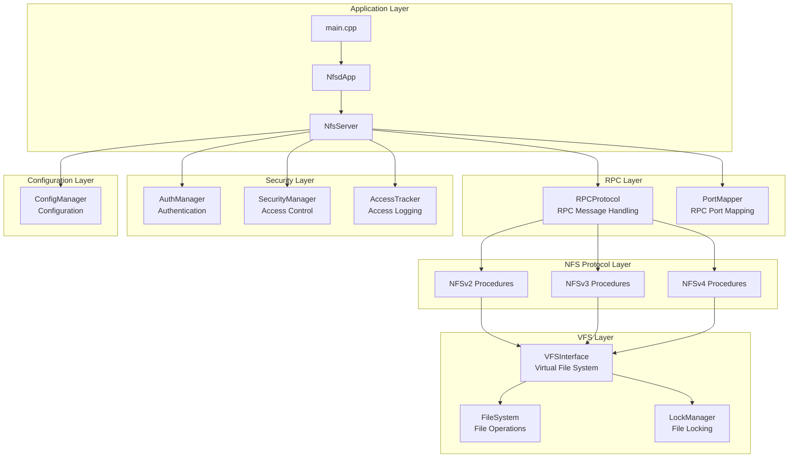
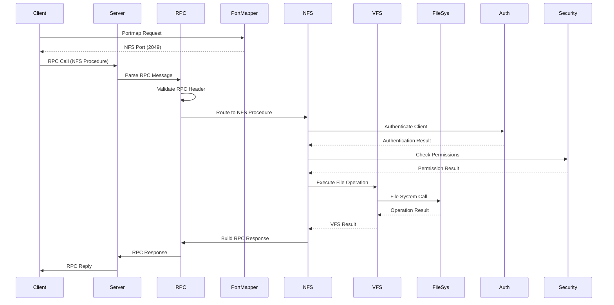

# Simple NFS Daemon - Architecture Diagrams

## System Architecture

```mermaid
graph TB
    subgraph "Application Layer"
        Main[main.cpp]
        App[NfsdApp]
        Server[NfsServer]
    end
    
    subgraph "RPC Layer"
        RPC[RPCProtocol<br/>RPC Message Handling]
        PortMapper[PortMapper<br/>RPC Port Mapping]
    end
    
    subgraph "NFS Protocol Layer"
        NFSv2[NFSv2 Procedures]
        NFSv3[NFSv3 Procedures]
        NFSv4[NFSv4 Procedures]
    end
    
    subgraph "VFS Layer"
        VFS[VFSInterface<br/>Virtual File System]
        FileSystem[FileSystem<br/>File Operations]
        Lock[LockManager<br/>File Locking]
    end
    
    subgraph "Security Layer"
        Auth[AuthManager<br/>Authentication]
        Security[SecurityManager<br/>Access Control]
        AccessTracker[AccessTracker<br/>Access Logging]
    end
    
    subgraph "Configuration Layer"
        Config[ConfigManager<br/>Configuration]
    end
    
    Main --> App
    App --> Server
    Server --> RPC
    Server --> PortMapper
    RPC --> NFSv2
    RPC --> NFSv3
    RPC --> NFSv4
    NFSv2 --> VFS
    NFSv3 --> VFS
    NFSv4 --> VFS
    VFS --> FileSystem
    VFS --> Lock
    Server --> Auth
    Server --> Security
    Server --> AccessTracker
    Server --> Config
```

## NFS Request Processing Flow

```mermaid
sequenceDiagram
    participant Client
    participant Server
    participant RPC
    participant PortMapper
    participant NFS
    participant VFS
    participant FileSys
    
    Client->>PortMapper: Portmap Request
    PortMapper-->>Client: NFS Port (2049)
    
    Client->>Server: RPC Call (NFS Procedure)
    Server->>RPC: Parse RPC Message
    RPC->>RPC: Validate RPC Header
    RPC->>NFS: Route to NFS Procedure
    NFS->>Auth: Authenticate Client
    Auth-->>NFS: Authentication Result
    NFS->>Security: Check Permissions
    Security-->>NFS: Permission Result
    NFS->>VFS: Execute File Operation
    VFS->>FileSys: File System Call
    FileSys-->>VFS: Operation Result
    VFS-->>NFS: VFS Result
    NFS->>RPC: Build RPC Response
    RPC->>Server: RPC Response
    Server->>Client: RPC Reply
```

