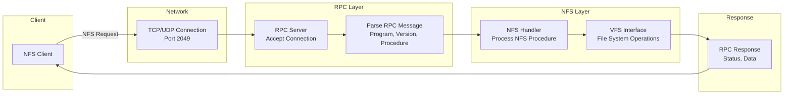

# Simple NFS Daemon - Data Flow Diagrams

## NFS Request Data Flow

```mermaid
flowchart LR
    subgraph "Client"
        C1[NFS Client]
    end

    subgraph "Network"
        N1[TCP/UDP Connection<br/>Port 2049]
    end

    subgraph "RPC Layer"
        RPC1[RPC Server<br/>Accept Connection]
        RPC2[Parse RPC Message<br/>Program, Version, Procedure]
    end

    subgraph "NFS Layer"
        NFS1[NFS Handler<br/>Process NFS Procedure]
        NFS2[VFS Interface<br/>File System Operations]
    end

    subgraph "Response"
        R1[RPC Response<br/>Status, Data]
    end

    C1 -->|NFS Request| N1
    N1 --> RPC1
    RPC1 --> RPC2
    RPC2 --> NFS1
    NFS1 --> NFS2
    NFS2 --> R1
    R1 --> C1
```
