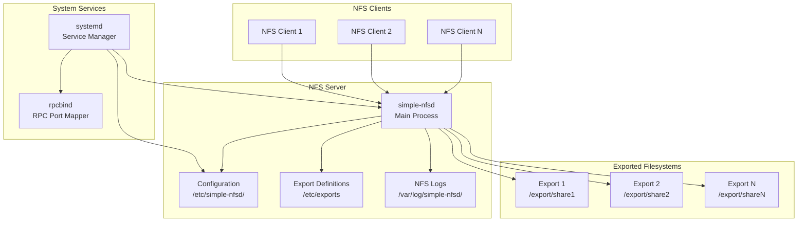
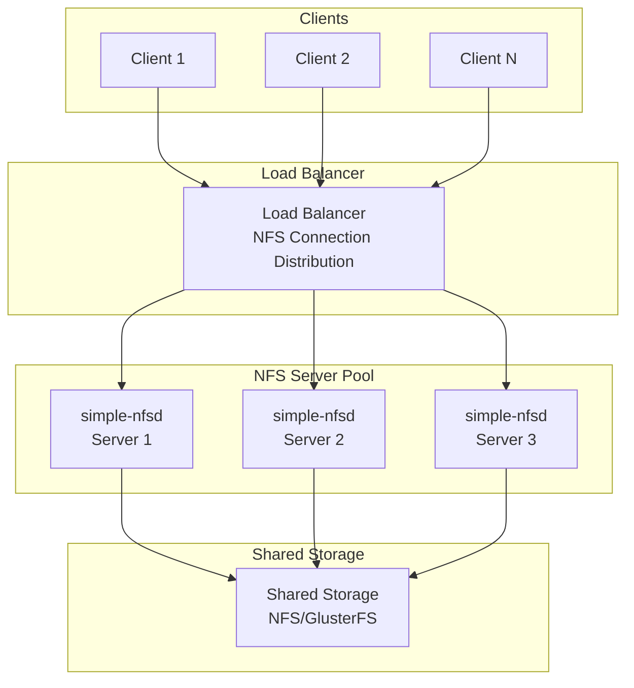

# Simple NFS Daemon - Deployment Diagrams

## Basic Deployment Architecture

```mermaid
graph TB
    subgraph "NFS Clients"
        Client1[NFS Client 1]
        Client2[NFS Client 2]
        ClientN[NFS Client N]
    end

    subgraph "NFS Server"
        Server[simple-nfsd<br/>Main Process]
        Config[Configuration<br/>/etc/simple-nfsd/]
        Exports[Export Definitions<br/>/etc/exports]
        Logs[NFS Logs<br/>/var/log/simple-nfsd/]
    end

    subgraph "Exported Filesystems"
        Export1[Export 1<br/>/export/share1]
        Export2[Export 2<br/>/export/share2]
        ExportN[Export N<br/>/export/shareN]
    end

    subgraph "System Services"
        Systemd[systemd<br/>Service Manager]
        Rpcbind[rpcbind<br/>RPC Port Mapper]
    end

    Client1 --> Server
    Client2 --> Server
    ClientN --> Server

    Systemd --> Server
    Systemd --> Config
    Systemd --> Rpcbind

    Server --> Config
    Server --> Exports
    Server --> Logs
    Server --> Export1
    Server --> Export2
    Server --> ExportN
```

## NFS High Availability Deployment

```mermaid
graph TB
    subgraph "Load Balancer"
        LB[Load Balancer<br/>NFS Connection Distribution]
    end

    subgraph "NFS Server Pool"
        Server1[simple-nfsd<br/>Server 1]
        Server2[simple-nfsd<br/>Server 2]
        Server3[simple-nfsd<br/>Server 3]
    end

    subgraph "Shared Storage"
        SharedStorage[Shared Storage<br/>NFS/GlusterFS]
    end

    subgraph "Clients"
        Client1[Client 1]
        Client2[Client 2]
        ClientN[Client N]
    end

    Client1 --> LB
    Client2 --> LB
    ClientN --> LB

    LB --> Server1
    LB --> Server2
    LB --> Server3

    Server1 --> SharedStorage
    Server2 --> SharedStorage
    Server3 --> SharedStorage
```
