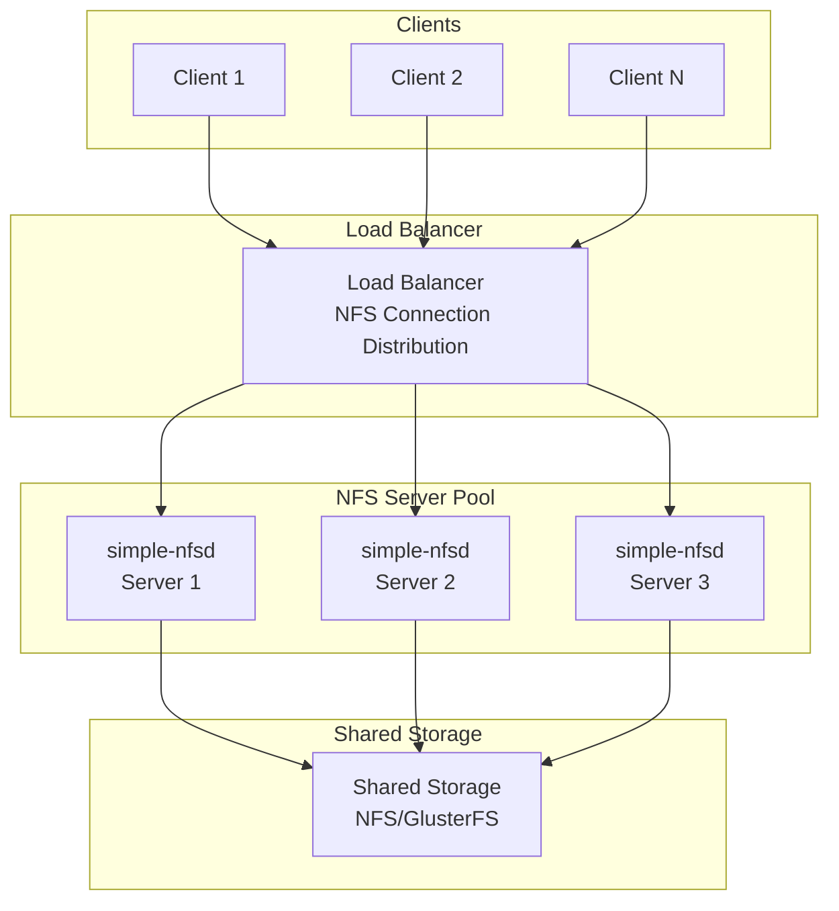

# Simple NFS Daemon - Deployment Diagrams

## Basic Deployment Architecture

```mermaid
graph TB
    subgraph "NFS Clients"
        Client1[NFS Client 1]
        Client2[NFS Client 2]
        ClientN[NFS Client N]
    end

    subgraph "NFS Server"
        Server[simple-nfsd<br/>Main Process]
        Config[/etc/simple-nfsd/<br/>Configuration]
        Exports[/etc/exports<br/>Export Definitions]
        Logs[/var/log/simple-nfsd/<br/>NFS Logs]
    end

    subgraph "Exported Filesystems"
        Export1[/export/share1<br/>Export 1]
        Export2[/export/share2<br/>Export 2]
        ExportN[/export/shareN<br/>Export N]
    end

    subgraph "System Services"
        Systemd[systemd<br/>Service Manager]
        Rpcbind[rpcbind<br/>RPC Port Mapper]
    end

    Client1 --> Server
    Client2 --> Server
    ClientN --> Server

    Systemd --> Server
    Systemd --> Config
    Systemd --> Rpcbind

    Server --> Config
    Server --> Exports
    Server --> Logs
    Server --> Export1
    Server --> Export2
    Server --> ExportN
```

## NFS High Availability Deployment


