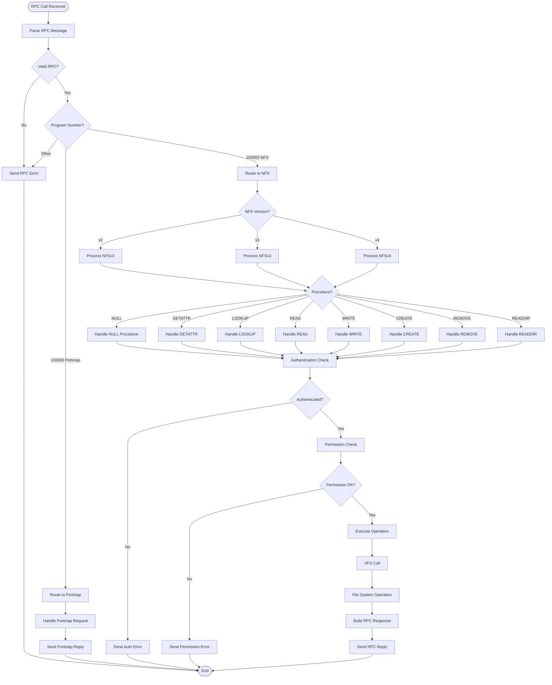
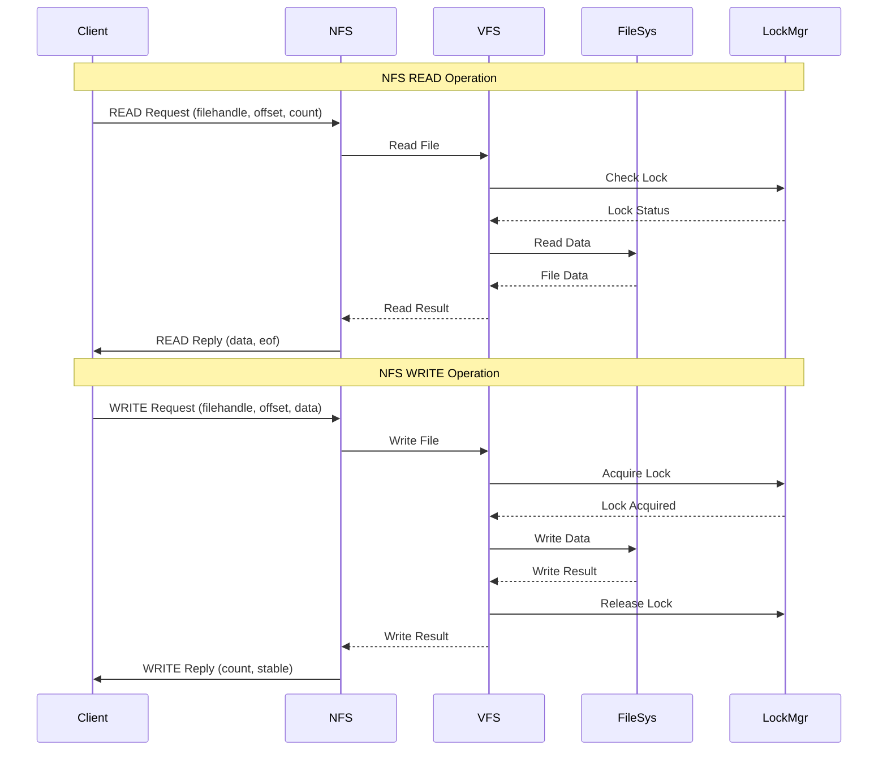

# Simple NFS Daemon - Flow Diagrams

## NFS Procedure Call Flow

```mermaid
flowchart TD
    Start([RPC Call Received]) --> ParseRPC[Parse RPC Message]
    ParseRPC --> ValidateRPC{Valid RPC?}
    ValidateRPC -->|No| SendRPCError[Send RPC Error]
    ValidateRPC -->|Yes| CheckProgram{Program Number?}
    
    CheckProgram -->|100003 NFS| RouteNFS[Route to NFS]
    CheckProgram -->|100000 Portmap| RoutePortmap[Route to Portmap]
    CheckProgram -->|Other| SendRPCError
    
    RoutePortmap --> HandlePortmap[Handle Portmap Request]
    HandlePortmap --> SendPortmapReply[Send Portmap Reply]
    
    RouteNFS --> CheckVersion{NFS Version?}
    CheckVersion -->|v2| ProcessV2[Process NFSv2]
    CheckVersion -->|v3| ProcessV3[Process NFSv3]
    CheckVersion -->|v4| ProcessV4[Process NFSv4]
    
    ProcessV2 --> CheckProcedure{Procedure?}
    ProcessV3 --> CheckProcedure
    ProcessV4 --> CheckProcedure
    
    CheckProcedure -->|NULL| HandleNULL[Handle NULL Procedure]
    CheckProcedure -->|GETATTR| HandleGETATTR[Handle GETATTR]
    CheckProcedure -->|LOOKUP| HandleLOOKUP[Handle LOOKUP]
    CheckProcedure -->|READ| HandleREAD[Handle READ]
    CheckProcedure -->|WRITE| HandleWRITE[Handle WRITE]
    CheckProcedure -->|CREATE| HandleCREATE[Handle CREATE]
    CheckProcedure -->|REMOVE| HandleREMOVE[Handle REMOVE]
    CheckProcedure -->|READDIR| HandleREADDIR[Handle READDIR]
    
    HandleNULL --> AuthCheck[Authentication Check]
    HandleGETATTR --> AuthCheck
    HandleLOOKUP --> AuthCheck
    HandleREAD --> AuthCheck
    HandleWRITE --> AuthCheck
    HandleCREATE --> AuthCheck
    HandleREMOVE --> AuthCheck
    HandleREADDIR --> AuthCheck
    
    AuthCheck --> AuthOK{Authenticated?}
    AuthOK -->|No| SendAuthError[Send Auth Error]
    AuthOK -->|Yes| PermCheck[Permission Check]
    
    PermCheck --> PermOK{Permission OK?}
    PermOK -->|No| SendPermError[Send Permission Error]
    PermOK -->|Yes| ExecuteOp[Execute Operation]
    
    ExecuteOp --> VFSCall[VFS Call]
    VFSCall --> FileSys[File System Operation]
    FileSys --> BuildResponse[Build RPC Response]
    BuildResponse --> SendResponse[Send RPC Reply]
    
    SendRPCError --> End([End])
    SendPortmapReply --> End
    SendAuthError --> End
    SendPermError --> End
    SendResponse --> End
```

## NFS File Operation Flow

```mermaid
sequenceDiagram
    participant Client
    participant NFS
    participant VFS
    participant FileSys
    participant LockMgr
    
    Note over Client,LockMgr: NFS READ Operation
    Client->>NFS: READ Request (filehandle, offset, count)
    NFS->>VFS: Read File
    VFS->>LockMgr: Check Lock
    LockMgr-->>VFS: Lock Status
    VFS->>FileSys: Read Data
    FileSys-->>VFS: File Data
    VFS-->>NFS: Read Result
    NFS->>Client: READ Reply (data, eof)
    
    Note over Client,LockMgr: NFS WRITE Operation
    Client->>NFS: WRITE Request (filehandle, offset, data)
    NFS->>VFS: Write File
    VFS->>LockMgr: Acquire Lock
    LockMgr-->>VFS: Lock Acquired
    VFS->>FileSys: Write Data
    FileSys-->>VFS: Write Result
    VFS->>LockMgr: Release Lock
    VFS-->>NFS: Write Result
    NFS->>Client: WRITE Reply (count, stable)
```

