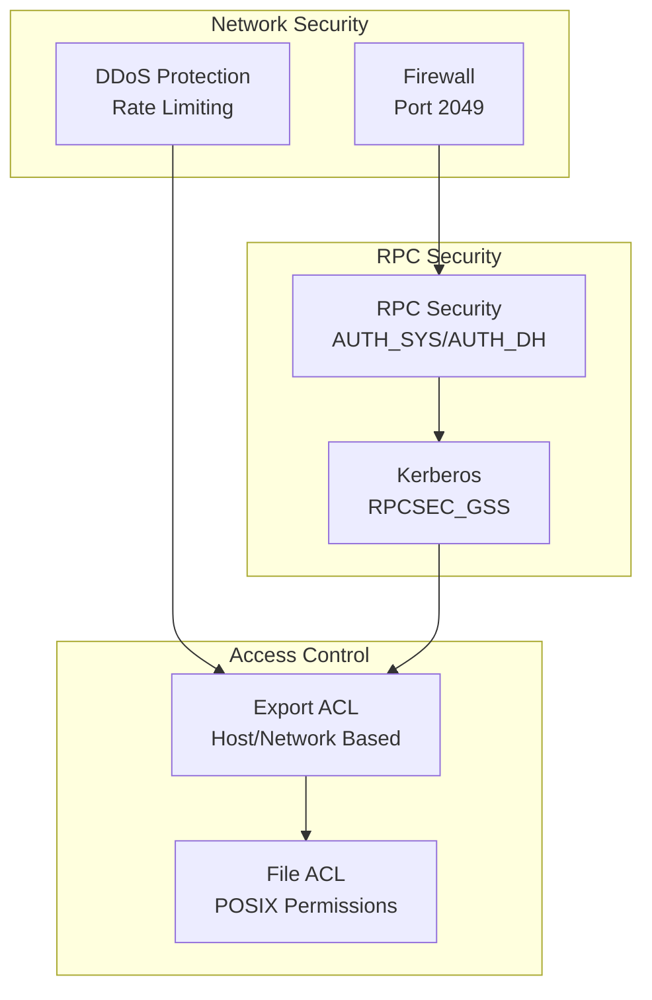
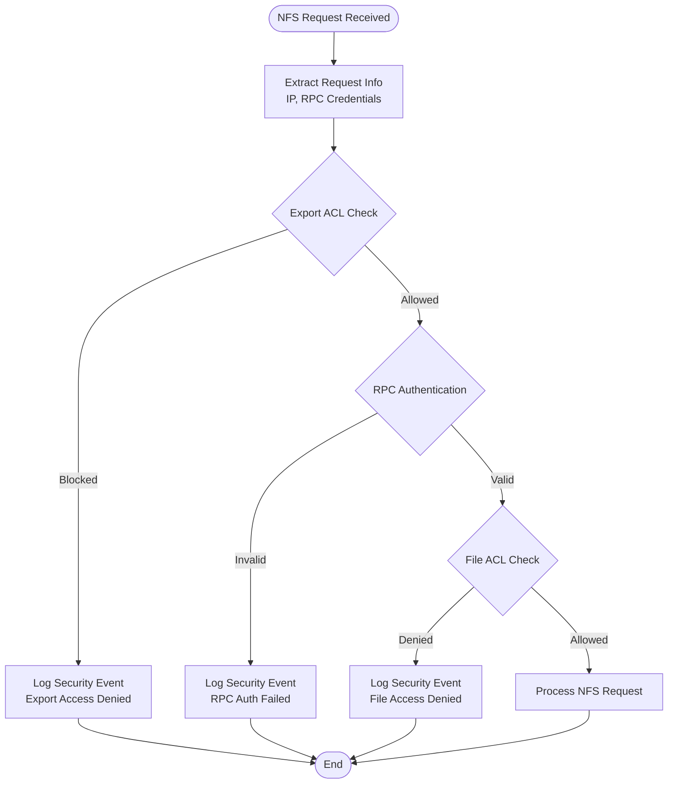

# Simple NFS Daemon - Security Diagrams

## Security Architecture

```mermaid
graph TB
    subgraph "Network Security"
        Firewall[Firewall<br/>Port 2049]
        DDoSProtection[DDoS Protection<br/>Rate Limiting]
    end

    subgraph "RPC Security"
        RPCSec[RPC Security<br/>AUTH_SYS/AUTH_DH]
        Kerberos[Kerberos<br/>RPCSEC_GSS]
    end

    subgraph "Access Control"
        ExportACL[Export ACL<br/>Host/Network Based]
        FileACL[File ACL<br/>POSIX Permissions]
    end

    Firewall --> RPCSec
    DDoSProtection --> ExportACL

    RPCSec --> Kerberos
    Kerberos --> ExportACL

    ExportACL --> FileACL
```

## Security Flow

```mermaid
flowchart TD
    Start([NFS Request Received]) --> ExtractInfo[Extract Request Info<br/>IP, RPC Credentials]

    ExtractInfo --> ACLCheck{Export ACL Check}
    ACLCheck -->|Blocked| LogBlock1[Log Security Event<br/>Export Access Denied]
    ACLCheck -->|Allowed| RPCAuthCheck

    RPCAuthCheck{RPC Authentication}
    RPCAuthCheck -->|Invalid| LogBlock2[Log Security Event<br/>RPC Auth Failed]
    RPCAuthCheck -->|Valid| FileACLCheck

    FileACLCheck{File ACL Check}
    FileACLCheck -->|Denied| LogBlock3[Log Security Event<br/>File Access Denied]
    FileACLCheck -->|Allowed| ProcessRequest

    ProcessRequest[Process NFS Request] --> End([End])

    LogBlock1 --> End
    LogBlock2 --> End
    LogBlock3 --> End
```
